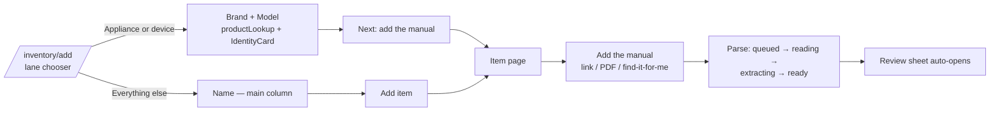

# Homehub user journeys — the happy paths that must not break

This document is the product's spine: the journeys a homeowner actually walks,
traced screen by screen against the code. Every step names the route, the
service behind it, and the spec that guards it — so when a spec goes red, this
doc says which *user promise* just broke; and when a journey changes, the doc
and its specs change **in the same PR**.

**Regeneration rule:** maintained by tracing the code, never from memory. If a
step table disagrees with the app, the app wins — update the doc (and the spec
column) in the PR that changed the flow.

**How the journeys are tested**
- `e2e/journey/journey.spec.ts` — the chained walks below, one worker, with a
  screenshot + note at every step (`npm run test:e2e:journey:emu`). The
  `/journey-smoke` skill has Claude *look at* the resulting gallery — layout
  collapses, empty states posing as success, and wrong copy are caught by eyes,
  not pixel diffs.
- `e2e/emu/*` — per-module specs against the same seeded emulator.
- Seeded identity: `e2e@homehub.test` **in the emulator only** — no real test
  accounts exist anywhere. AI callables are stubbed at the network layer; a
  live parse never runs in e2e (that lives in `evals/manual-parser/`).

---

## Journey 1 — Onboarding: brand-new person to first item

**Promise:** from "never heard of Homehub" to a home with its first item,
without a dead end — and every profile question skippable ("suggest, never
assume").

```mermaid
flowchart LR
    A[Marketing page /] --> B[Create account /signup]
    B --> C["Set up your home"\nname + invite code when gated]
    C --> D[Home profile /onboarding/profile\n5 questions, all skippable]
    D --> E[First item /inventory/add\nlane chooser]
    E --> F[Item page /items/:id]
    F --> G[Home: "No upkeep yet"\n+ first-run tour]
    B -. "?returnTo=/invite/…" .-> H[Accept invite /invite/:token]
```

| # | User sees / does | Route | Key code | Writes |
|---|---|---|---|---|
| 1 | Marketing page → Get started / Sign in | `/` | `src/pages/Landing.tsx` | — |
| 2 | Email+password (**Create account**), magic link, Apple (flag-gated) | `/signup` | `src/modules/auth/components/SignInForm.tsx`, `AuthProvider.tsx` | Auth user |
| 3 | **Set up your home** — name; invite-code field only when the growth gate is on | `/` | `HomeOnboarding.tsx` → `createHome` / `redeemInviteCode` | `homes/{id}`, `members/{uid}`, 9 default rooms |
| 4 | Home profile: type → own/rent → climate → concerns → mode; **Skip for now** honored | `/onboarding/profile` | `HomeProfileOnboarding.tsx` → `upsertHomeProfile` | profile fields folded onto `homes/{id}` |
| 5 | The funnel continues into the first item — skip does NOT strand you on Home | `/onboarding/inventory` → `/inventory/add` | `App.tsx` redirect (HH-81) | — |
| 6 | Lane chooser → simple lane: **Name on the main column** → Add item | `/inventory/add` | `IdentifyStep.tsx`, `SmartAddItem.tsx` → `createItemUnit` | `homes/{id}/items/{id}` |
| 7 | Item page; "no manual yet" care block invites the manual | `/items/:id` | `CareBlock.tsx` | — |
| 8 | Home: first-run tour (1 of 5, Esc-closable), then **"No upkeep yet — add a manual"** with the item under "Finish setting up" | `/home` | `useFeatureTour`, `Home.tsx` | — |

**Guards that make or break this journey**
- `AuthGate` / `HomeGate`; the **`fromCache` guard** in `homeService.getMyHomes` —
  an empty membership read served from cache is an *error*, never "no home"
  (the duplicate-home-incident fix). `HomeOnboarding` re-checks before creating.
- **Invite gate** (`docs/invite-gate.md`): rules require `createdBy == auth.uid && admitted()`;
  `admitted()` fails open when `config/growth` is absent (so the emulator needs no code).
- **The funnel handoff** (regressed → fixed in #150): Index must not let its
  signed-in redirect stomp the navigation to `/onboarding/profile`
  (`funnelingRef`), `refresh(homeId)` polls until the members collection-group
  query can see a just-created home, and `OnboardingProfile` gives the context
  a grace window before bouncing.

**Spec coverage:** `journey.spec.ts` J1 (signup → home → profile → simple-lane
item → "No upkeep yet") · `emu/auth-home` · `emu/smart-add` (the spec that
caught the accordion dead-end) · rules tests, `inviteActions.emu`, `membership.emu`.

---

## Journey 2 — Add item & attach its manual

**Promise:** "a name is enough to start"; brand+model finds the manual, and
the manual is where upkeep comes from.



Key mechanics (fuller trace in `docs/firestore-model.md` §8):
- **Appliance lane:** name optional (composes "Brand Model", HH-23); debounced
  `productLookup`; explicit *Use this / Not my product*; label-photo OCR as an
  assist (`ocr` callable — Vision + Claude fallback), tips shown before the
  camera opens.
- **Doc-type honesty:** `detectDocType` gates spec sheets/warranties (*Use
  anyway / Replace*); `modelMismatch` warns on wrong variants — warn, never block.
- **Parse pipeline:** `enqueueParse` (membership + quota: 10 units, in-flight
  cap 5/home) → Cloud Task → `parseWorker` → stages on `manuals/{id}.parse.stage`
  → `previewDraft`. Preview **never commits** without review. Walking away is
  safe — `ParsePickupCard` resumes.
- **The 5-step wizard header is vestigial** — steps 2–5 are unreachable (no
  code path creates a wizard session). The real step 2 is the item page's
  Add-manual dialog.
- **Spend caps** (`shared/quota/policy.ts`, enforced in `lib/quota.ts`):
  50 units/user/day, 20k/month app-wide, per-minute rate + burst caps; a
  throttled call costs nothing; quota errors surface as quiet form notices.

**Spec coverage:** `emu/smart-add` (simple-lane create + OCR states, stubbed) ·
`emu/storage` (photo upload) · `emu/knowledge*` (manual docs/chunks) ·
`worker.emu`, `quota.emu` (server) · parser quality: `evals/manual-parser/`.

---

## Journey 3 — Review parsed tasks

**Promise:** nothing enters the schedule without the homeowner agreeing —
and every correction teaches the parser.

```mermaid
flowchart LR
    A[previewDraft ready] --> B[Review sheet auto-opens\nonce, if the parse was yours]
    B --> C[Step 1 · What each task is\nkind / tier / remind / skip]
    C --> D[Step 2 · How often\n"The manual says…" + custom cadence\n+ "I've been doing this already"]
    D --> E[Save N tasks · M tips]
    E --> F[commitManualDraft:\nhouse rules → reconcile → instances]
    C -.-> G["These don't look right?"\nre-scan / feedback]
    E -.-> H[Every edit recorded\nparseFeedback + taskFeedback]
```

Key mechanics:
- Entry points: post-parse auto-open (`ParsePickupCard`, once per manual),
  **Review tasks** on an item's Upkeep heading (mobile layout), wizard legacy.
- Thin-manual warning first (`shared/parse/pdfShape.ts`).
- Save → `commitManualDraft` re-normalizes server-side, re-applies **house
  rules** (`applyHouseRules` — a freeze-free home suppresses the freeze_prep
  family), reconciles templates by `externalKey` (**never deleting
  completion-bearing tasks**), mints first instances one cadence from the
  anchor (`last_done_on ?? today`).
- Every correction becomes `review_save` feedback; generalizable ones carry a
  cross-home `patternKey` for the weekly `graduateFeedback` aggregation.
  Feedback **never edits the prompt** — candidates route through the goldens.

**Spec coverage:** `journey.spec.ts` J3 (mobile-width walk of the wizard) ·
`emu/task-review` · `commitManualDraft.emu`, `lastDoneAnchor.emu` (server).

---

## Journey 4 — Live with your tasks (agenda, detail, snooze)

**Promise:** relevant, useful, timely — windows not deadlines, calm by
default, "this isn't right" always one tap away.

```mermaid
flowchart LR
    A[Home /home\n"A good week for these"] --> B[Tasks /maintenance\nlenses + calendar]
    B --> C[Row expands:\nMark done / Snooze / View full guide]
    C --> D[Task detail /tasks/:id\nwindow phrase, steps]
    D --> E[Mark done → completeTask\nnext instance minted]
    A --> F[Snooze +14 from the hero\nvisible Undo]
    D --> G["This isn't right"\nchips + sweep + Discuss]
```

Key mechanics:
- One `taskInstances` read feeds everything (denormalized fields;
  `getWeekAgenda`, `useDashboard`). Due windows derived at read time
  (`shared/care/dueWindow.ts`) — **only a passed deadline is ever "overdue"**;
  lapsed safety earns **"Worth doing — N safety checks have skipped a cycle"**
  (`computeInsight`); seasonal windows resolve against home climate; an empty
  agenda explains what's withheld.
- Desktop rows expand in place (Mark done / Snooze / **View full guide** →
  `/tasks/:id`); mobile rows navigate directly.
- **Complete** → `completeTask` callable: one transaction marks done, computes
  the next due, suppresses duplicates, mints the next instance. (Browser-level
  Mark done needs the functions emulator — covered server-side by
  `completeTask.emu`; the journey walk exercises **Snooze + Undo** instead,
  which are pure Firestore writes.)
- Feedback: chips (+ sub-pickers), similar-task sweep, Discuss (grounded in
  manual chunks, may propose ONE chip-shaped edit), deterministic safety
  pushback on hazard downgrades; resolutions write append-only `taskFeedback`
  and (when generalizable) visible `houseRules` that `commitDraft` replays.
- Push: deadlines the day they land; everything else in the Sunday digest —
  selection uses the same agenda filter, so a push can't contradict the screen.

**Spec coverage:** `journey.spec.ts` J4 (hero → agenda → expanded row → detail
→ snooze + undo) · `emu/tasks`, `emu/home`, `emu/item-detail` ·
`completeTask.emu`, `rollForward.emu`, `discussTask.emu` (server).

---

## Coverage map

| Journey | Chained walk | Module specs | Server-side |
|---|---|---|---|
| J1 Onboarding | `journey.spec.ts` J1 | `emu/auth-home`, `emu/smart-add` | rules tests, `inviteActions.emu`, `membership.emu` |
| J2 Add + manual | J1 covers simple add | `emu/smart-add`, `emu/storage`, `emu/knowledge*` | `worker.emu`, `quota.emu`, parser goldens |
| J3 Review | `journey.spec.ts` J3 | `emu/task-review` | `commitManualDraft.emu`, `lastDoneAnchor.emu` |
| J4 Agenda | `journey.spec.ts` J4 | `emu/tasks`, `emu/home`, `emu/item-detail` | `completeTask.emu`, `rollForward.emu`, `discussTask.emu` |

**Known gaps (deliberate, revisit when they hurt):**
- Browser-level **Mark done** and the **parse-progress** UI need the functions
  emulator in the e2e stack; both are covered server-side today.
- **Invite acceptance** has no browser journey (server-tested).
- Live AI parse quality is never e2e — `evals/manual-parser/` owns it.
- The a11y suite has an order-dependent mobile flake (a late mobile page
  times out waiting for seeded data when run 10+ tests deep); passes in
  isolation. Predates the journey work.
