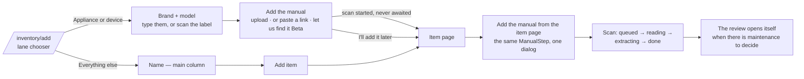
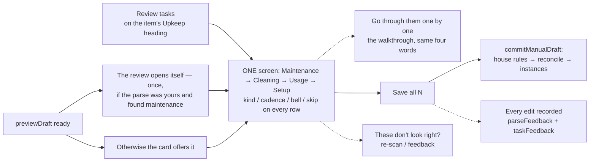
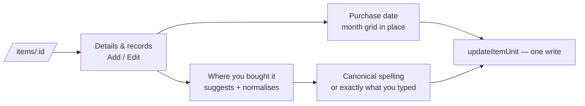

# Homehub user journeys — the happy paths that must not break

This document is the product's spine: the journeys a homeowner actually walks,
traced screen by screen against the code. Every step names the route, the
service behind it, and the spec that guards it — so when a spec goes red, this
doc says which *user promise* just broke; and when a journey changes, the doc
and its specs change **in the same PR**.

**Regeneration rule:** maintained by tracing the code, never from memory. If a
step table disagrees with the app, the app wins — update the doc (and the spec
column) in the PR that changed the flow.

**How the journeys are tested**
- `e2e/journey/journey.spec.ts` — the chained walks below, one worker, with a
  screenshot + note at every step (`npm run test:e2e:journey:emu`). The
  `/journey-smoke` skill has Claude *look at* the resulting gallery — layout
  collapses, empty states posing as success, and wrong copy are caught by eyes,
  not pixel diffs.
- `e2e/emu/*` — per-module specs against the same seeded emulator.
- Seeded identity: `e2e@homehub.test` **in the emulator only** — no real test
  accounts exist anywhere. AI callables are stubbed at the network layer; a
  live parse never runs in e2e (that lives in `evals/manual-parser/`).

---

## Journey 1 — Onboarding: brand-new person to first item

**Promise:** from "never heard of Homehub" to a home with its first item,
without a dead end — and every profile question skippable ("suggest, never
assume").

```mermaid
flowchart LR
    A[Marketing page /] --> B[Create account /signup]
    B --> C["Set up your home"\nname + invite code when gated]
    C --> D[Home profile /onboarding/profile\n5 questions, all skippable]
    D --> D2{"Where next?"\nAdd your first item / Take me to my home page}
    D2 -->|Add your first item| E[First item /inventory/add\nlane chooser]
    D2 -->|Take me to my home page| G
    E --> F[Item page /items/:id]
    F --> G[Home: "No upkeep yet"\n+ first-run tour]
    B -. "?returnTo=/invite/…" .-> H[Accept invite /invite/:token]
```

| # | User sees / does | Route | Key code | Writes |
|---|---|---|---|---|
| 1 | Marketing page → Get started / Sign in | `/` | `src/pages/Landing.tsx` | — |
| 2 | Email+password (**Create account**), magic link, Apple (flag-gated) | `/signup` | `src/modules/auth/components/SignInForm.tsx`, `AuthProvider.tsx` | Auth user |
| 3 | **Set up your home** — name; invite-code field only when the growth gate is on | `/` | `HomeOnboarding.tsx` → `createHome` / `redeemInviteCode` | `homes/{id}`, `members/{uid}`, 9 default rooms |
| 4 | Home profile: type → own/rent → climate → concerns → mode; **Skip for now** honored | `/onboarding/profile` | `HomeProfileOnboarding.tsx` → `upsertHomeProfile` | profile fields folded onto `homes/{id}` |
| 5 | **"Your home profile is set — where to next?"**: *Add your first item* / *Take me to my home page*. Asked, not assumed (HH-93) | `/onboarding/profile` | `OnboardingProfile.tsx` (`ProfileDone`) | — |
| 6 | Lane chooser → simple lane: **Name on the main column** → Add item | `/inventory/add` | `IdentifyStep.tsx`, `SmartAddItem.tsx` → `createItemUnit` | `homes/{id}/items/{id}` |
| 6b | Appliance lane instead: brand + model → **Add the manual** (the button and the next screen share the words) → attaching it starts the scan and lands on the item page (J2) | `/inventory/add` | `SmartAddItem.tsx` → `startParseAndLeave` | `homes/{id}/manuals/{id}`, `parse.stage` |
| 7 | Item page: the name first; Upkeep leads **"No upkeep yet — add the manual"** with one **Add the manual** door (HH-91). One tree for the width, so one of each (HH-159). While a manual is being read: **"Reading the manual"** — one line and an indeterminate rail, and "You can close the app — these keep going." (HH-135, HH-116); the tray pill stands down on this page (HH-118) | `/items/:id` | `ItemDetailPage.tsx` (`useIsDesktop`), `CareBlock.tsx`, `ParsePickupCard.tsx`, `ParseTrayPill.tsx` | — |
| 7b | Scan done → **the review, one screen**: Maintenance → Cleaning → Usage → Setup, each row carrying its own cadence and bell. A section of the page for anyone who watched the scan run, a drawer for anyone who came back; it opens itself only when there is maintenance to decide (HH-121). With none, round 14's card reports instead ("We finished reading the … manual") — superseded in `docs/add-item-flow.md`, to be retired by the HH-161 work (Package E2) | `/items/:id` | `ParsePickupCard.tsx`, `TaskReviewSheet.tsx` | `commitManualDraft` → `taskTemplates`, `taskInstances` |
| 8 | Home: the first-run tour (5 steps, the first titled **"Welcome"**, Esc-closable), then **"No upkeep yet — add a manual"** (Pick an item / Add another item) — the profile banner yields to it (HH-80) | `/home` | `useFeatureTour`, `tourSteps.ts`, `Home.tsx` | — |

**Guards that make or break this journey**
- `AuthGate` / `HomeGate`; the **`fromCache` guard** in `homeService.getMyHomes` —
  an empty membership read served from cache is an *error*, never "no home"
  (the duplicate-home-incident fix). `HomeOnboarding` re-checks before creating.
- **Invite gate** (`docs/invite-gate.md`): rules require a non-anonymous caller,
  `createdBy == auth.uid` and `admitted()`. `admitted()` fails CLOSED when `config/growth`
  is absent, so `npm run seed:emu` writes `config/growth: {inviteGateEnabled: false}` —
  that seeded doc is why this walk needs no code.
- **The funnel handoff** (regressed → fixed in #150): Index must not let its
  signed-in redirect stomp the navigation to `/onboarding/profile`
  (`funnelingRef`), `refresh(homeId)` polls until the members collection-group
  query can see a just-created home, and `OnboardingProfile` gives the context
  a grace window before bouncing.

**The 2026-08-22 flow change (PRs #160–#163):** the profile no longer funnels
straight into the add form — it offers the two doors above. The wizard ends at
the manual; Reading, Review and Purchase left it. The item page watches the
manual being read and asks for ONE review. Round 18 (#185) made that review one
screen grouped by kind; `docs/add-item-flow.md` is the canonical flow.

**Spec coverage:** `journey.spec.ts` J1 (signup → home → profile → simple-lane
item → the tour → "No upkeep yet"; steps 7b and the scan are J2's and
`emu/item-page-manual`'s) · `emu/auth-home` · `emu/smart-add` (the spec that
caught the accordion dead-end) · rules tests, `inviteActions.emu`, `membership.emu`.

---

## Journey 2 — Add item & attach its manual

**Promise:** "a name is enough to start"; brand+model finds the manual, and
the manual is where upkeep comes from.

```mermaid
flowchart LR
    A[/inventory/add\nlane chooser/] -->|Appliance or device| B[Brand + model\ntype them, or scan the label]
    A -->|Everything else| C[Name — main column]
    B --> D["Add the manual"\nupload · or paste a link · let us find it Beta]
    C --> E[Add item]
    D -->|scan started, never awaited| F[Item page]
    D -->|I'll add it later| F
    E --> F
    F --> G[Add the manual from the item page\nthe same ManualStep, one dialog]
    G --> H[Scan: queued → reading →\nextracting → done]
    H --> I[The review opens itself\nwhen there is maintenance to decide]
```

Key mechanics (the agreement is `docs/add-item-flow.md`; fuller data trace in
`docs/firestore-model.md` §8):
- **Two screens, and the wizard ends at the manual.** Identify, then Add the
  manual (appliance lane only). The Stepper is retired (`retiredDesigns.test.ts`).
  An appliance add writes a wizard session (`setWizardSession`, step `manual`),
  so leaving on the manual screen resumes there; retired steps normalise
  forward (`wizardSession.ts`).
- **Appliance lane (HH-110, HH-123):** two fields, brand and model. Scanning the
  label is a first-class choice under an "or" rule (`ocr` callable — Vision +
  Claude fallback), and a scan overwrites both as a pair (HH-139). Tips appear
  only after a read comes back empty. **No lookup runs here** (round 18):
  `runPostCreateLookup` fires once after the item exists, and whatever it finds
  waits on the item page as suggestions.
- **The manual step is RANKED (HH-109, HH-115):** choosing a file leads and
  carries the only filled control; paste-a-link says *must end in .pdf* and
  hands over a Google search for the model (HH-129); **search is last**, badged
  Beta, and says it often returns the wrong document. The drop zone exists on
  desktop only. Zero-byte files are refused before any upload (HH-128); at
  capacity the button stands down and says the scan is queued (HH-124, HH-131).
- **The item page's door is the same component.** Upkeep's *Add the manual*,
  the drop-zone, *Paste a link instead* and *Find it for me* all open one
  dialog rendering `ManualStep` (HH-126), and work on the first tap (HH-159).
- **Naming (HH-112):** `composeItemName` names the item for what it is — the
  category label, with the room appended only when that name is taken. Known
  gap: an appliance-lane add still starts as "Brand Model" (Package E3).
- **Vocabulary:** the app SCANS a manual. Never "parse" (jargon) and never
  "read" (which implies we are opening it for the user to read).
- **Doc-type honesty:** `detectDocType` gates spec sheets/warranties (*Use
  anyway / Replace*); `modelMismatch` warns on wrong variants — warn, never block.
- **Parse pipeline:** `enqueueParse` (membership + quota: 10 units, in-flight
  cap 5/home; writes `parse.stage = "queued"` before it returns) → Cloud Task →
  `parseWorker` → stages on `manuals/{id}.parse.stage` → `previewDraft`.
  Preview **never commits** without review. The wizard starts the scan and
  leaves; the item page **watches it and never starts one** (audit 2026-09-29).
- **Spend caps:** per-user daily and app-wide monthly unit ceilings, per-minute
  rate and burst caps — the numbers live in `shared/quota/policy.ts` (enforced in
  `firebase/functions/src/lib/quota.ts`); a throttled call costs nothing; quota
  refusals surface as calm notices, never errors.

**Spec coverage:** `journey.spec.ts` J2 (appliance lane → the ranked manual
step → the item page, enqueue stubbed) · `emu/smart-add` (simple-lane create,
OCR states, exactly one enqueue per add) · `emu/item-add-manual` (the item
page's upload doors at 390px and desktop) · `emu/item-page-manual` (the link
lane from a seeded appliance, the scan's live state, the tray) · `emu/scan-fit`
· `emu/storage` · `emu/knowledge*` · `worker.emu`, `quota.emu` (server) ·
parser quality: `evals/manual-parser/`.

---

## Journey 3 — Review parsed tasks

**Promise:** nothing enters the schedule without the homeowner agreeing —
and every correction teaches the parser.

```mermaid
flowchart LR
    A[previewDraft ready] --> B[The review opens itself — once,\nif the parse was yours and found maintenance]
    A --> B2[Otherwise the card offers it]
    R[Review tasks\non the item's Upkeep heading] --> C
    B --> C[ONE screen: Maintenance → Cleaning → Usage → Setup\nkind / cadence / bell / skip on every row]
    B2 --> C
    C -.-> W[Go through them one by one\nthe walkthrough, same four words]
    C --> E[Save all N]
    E --> F[commitManualDraft:\nhouse rules → reconcile → instances]
    C -.-> G["These don't look right?"\nre-scan / feedback]
    E -.-> H[Every edit recorded\nparseFeedback + taskFeedback]
```

Key mechanics:
- **One screen, grouped by what a task IS** (round 18, #185): Maintenance →
  Cleaning → Usage → Setup, Setup collapsed (HH-85). Importance is a rail on
  the row, not a heading. No maintenance simply means no Maintenance section
  (HH-142). There is no step 2 and no "Next" — each row carries its cadence
  chip and its bell, and the walkthrough survives for going one by one (HH-144).
- **The summary states two channels, apart:** how many show up in Tasks when
  due, and how many also notify the phone. Essential is the only
  notify-by-default. Known gap: the Tasks count includes item-scoped cleaning,
  which the Tasks list leaves out (Package E2).
- **Three doors, one screen (HH-119):** `ParsePickupCard` (after a scan),
  **Review tasks** on the item's Upkeep heading (`ReviewItemTasksButton`, the
  phone layout), and the manual section's own review (`ManualSection`). The
  `focus` prop defaults to the approved review, so a door that passes nothing
  gets it; `src/lib/designContracts.test.ts` fails if a fourth door appears.
- It never claims rows are saved while its button is what saves them (HH-134):
  tasks already on the item say **Done**; a fresh parse says **Save all N**.
- Thin-manual warning first (`shared/parse/pdfShape.ts`).
- Save → `commitManualDraft` re-normalizes server-side, re-applies **house
  rules** (`applyHouseRules` — a freeze-free home suppresses the freeze_prep
  family), reconciles templates by `externalKey` (**never deleting
  completion-bearing tasks**), mints first instances one cadence from the
  anchor (`last_done_on ?? today`).
- Every correction becomes `review_save` feedback; generalizable ones carry a
  cross-home `patternKey` for the weekly `graduateFeedback` aggregation.
  Feedback **never edits the prompt** — candidates route through the goldens.

**Spec coverage:** `journey.spec.ts` J3 (phone-width walk of the one-screen
review from **Review tasks** on the seeded dishwasher — its tasks are already
saved, so it ends on Done and writes nothing) · `emu/task-review` (the review
WRITE: a cadence and a bell changed, saved, read back) · `emu/notice-fit` ·
`TaskReviewSheet.*.test.tsx`, `src/lib/designContracts.test.ts` ·
`commitManualDraft.emu`, `lastDoneAnchor.emu` (server).

---

## Journey 4 — Live with your tasks (agenda, detail, snooze)

**Promise:** relevant, useful, timely — windows not deadlines, calm by
default, "this isn't right" always one tap away.

```mermaid
flowchart LR
    A[Home /home\n"This week", first task open] --> B[Tasks /maintenance\nlenses + calendar]
    B --> C[Row expands:\nMark done / Snooze / View full guide]
    C --> D[Task detail /tasks/:id\nwindow phrase, steps]
    D --> E[Mark done → completeTask\nnext instance minted]
    A --> F[Snooze +14 from the open row\nvisible Undo]
    D --> G["This isn't right"\nchips + sweep + Discuss]
```

Key mechanics:
- One `taskInstances` read feeds everything (denormalized fields;
  `getWeekAgenda`, `useDashboard`). Due windows derived at read time
  (`shared/care/dueWindow.ts`) — **only a passed deadline is ever "overdue"**;
  lapsed safety earns **"Worth doing — N safety checks have skipped a cycle"**
  (`computeInsight`); seasonal windows resolve against home climate; an empty
  agenda explains what's withheld.
- Home is ONE list (`ThisWeekList`, design/home-focus.md): the week's tasks
  with the first open; any row opens the same way and closes the other; the
  open row shows when · cadence · minutes, one prep line ("You'll need…" /
  "Schedule a visit with a technician."), Mark done / Snooze / **See details**
  → `/tasks/:id`. "All tasks" is the only door out. The stat band, the swipe
  face, the Coming-up drawer and the 7-day strip are gone.
- Tasks: desktop rows expand in place (Mark done / Snooze / **View full
  guide** → `/tasks/:id`); mobile rows navigate directly.
- **Complete** → `completeTask` callable: one transaction marks done, computes
  the next due, suppresses duplicates, mints the next instance. (Browser-level
  Mark done needs the functions emulator — covered server-side by
  `completeTask.emu`; the journey walk exercises **Snooze + Undo** instead,
  which are pure Firestore writes.)
- Feedback: chips (+ sub-pickers), similar-task sweep, Discuss (grounded in
  manual chunks, may propose ONE chip-shaped edit), deterministic safety
  pushback on hazard downgrades; resolutions write append-only `taskFeedback`
  and (when generalizable) visible `houseRules` that `commitDraft` replays.
- Push: deadlines the day they land; everything else in the Sunday digest —
  selection uses the same agenda filter, so a push can't contradict the screen.

**Spec coverage:** `journey.spec.ts` J4 (Home's open row → agenda → expanded
row → detail → snooze + undo) · `emu/tasks`, `emu/home`, `emu/home-week`,
`emu/item-detail` ·
`completeTask.emu`, `rollForward.emu`, `discussTask.emu` (server).

---

## Journey 5 — Records: purchase date and where you bought it

**Promise:** the two fields a warranty or insurance claim asks for are quick to
enter and consistent once entered.

```mermaid
flowchart LR
    A[/items/:id/] --> B[Details & records\nAdd / Edit]
    B --> C[Purchase date\nmonth grid in place]
    B --> D[Where you bought it\nsuggests + normalises]
    D --> E[Canonical spelling\nor exactly what you typed]
    C --> F[updateItemUnit — one write]
    E --> F
```

Key mechanics:
- **Date:** `DateField` opens a month grid in place rather than the iOS wheel —
  a purchase date is nearly always a month or two back, which is three columns
  of scrolling on the native control. Always six rows so the buttons don't move
  under your thumb. Future dates are refused.
- **Timezone:** `lib/monthGrid.ts` is pure number/string work.
  `new Date("2024-03-14")` is UTC midnight, i.e. the 13th anywhere west of
  Greenwich — the bug that silently moves a purchase date back a day on every
  reload. Pinned by tests that pass in three timezones.
- **Store:** `StoreField` merges this home's own `store_name` values (ranked by
  use) with a curated seed in `lib/storeSuggestions.ts`, so the first item gets
  help and the second normalises. The raw text is **always** the last option —
  suggesting is not deciding.
- **One read, two autocompletes:** the item page already fetched every home item
  for tag suggestions; store history comes from that same snapshot.

**Spec coverage:** `journey.spec.ts` J5 · `lib/monthGrid.test.ts` (13) ·
`lib/storeSuggestions.test.ts` (16) · `lib/itemName.test.ts` (12).

---

## Coverage map

| Journey | Chained walk | Module specs | Server-side |
|---|---|---|---|
| J1 Onboarding | `journey.spec.ts` J1 | `emu/auth-home`, `emu/smart-add` | rules tests, `inviteActions.emu`, `membership.emu` |
| J2 Add + manual | `journey.spec.ts` J2 | `emu/smart-add`, `emu/item-add-manual`, `emu/item-page-manual`, `emu/scan-fit`, `emu/storage`, `emu/knowledge*` | `worker.emu`, `quota.emu`, parser goldens |
| J3 Review | `journey.spec.ts` J3 | `emu/task-review`, `emu/notice-fit` | `commitManualDraft.emu`, `lastDoneAnchor.emu` |
| J4 Agenda | `journey.spec.ts` J4 | `emu/tasks`, `emu/home`, `emu/item-detail` | `completeTask.emu`, `rollForward.emu`, `discussTask.emu` |
| J5 Records | `journey.spec.ts` J5 | `monthGrid`, `storeSuggestions`, `itemName` unit specs | — (client-only write via `updateItemUnit`) |

Across J1–J3, `src/lib/designContracts.test.ts` pins the add-item flow's rules
(`docs/add-item-flow.md`) as behaviour in the unit run — the rules still unmet
are its `it.todo`s, each naming the package that turns it on.

**Known gaps (deliberate, revisit when they hurt):**
- Browser-level **Mark done** needs the functions emulator in the e2e stack;
  it is covered server-side today. The **scan's progress** is walked only up to
  `queued`: `emu/item-page-manual` fakes the stage `enqueueParse` writes, and
  the worker's later stages are covered by `worker.emu`.
- The walk from an item-page attach **into the review** needs a draft the
  worker never writes in e2e; `emu/task-review` covers the review from Review
  tasks instead.
- **Invite acceptance** has no browser journey (server-tested).
- Live AI parse quality is never e2e — `evals/manual-parser/` owns it.
- The a11y suite has an order-dependent mobile flake (a late mobile page
  times out waiting for seeded data when run 10+ tests deep); passes in
  isolation. Predates the journey work.
